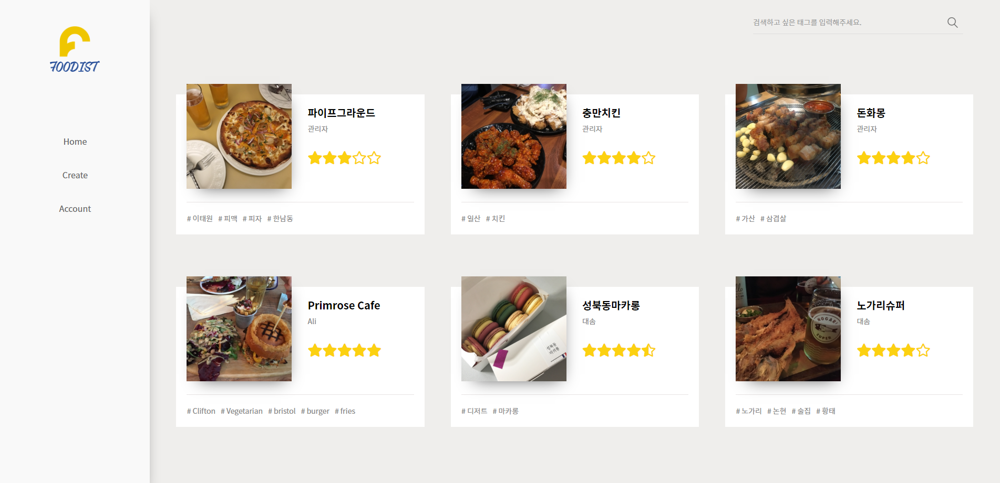

# Foodist


- 식당 리뷰 웹 서비스를 React와 Firebase를 이용하여 반응형 웹을 SPA로 제작, 운영
- Firebase 호스팅 주소 : https://foodist-react.firebaseapp.com/

## Intro
- 평소 맛집 찾아다니고 음식에 대해 평가하는 것을 좋아하는데, __'이것을 기록으로 남겨서 주변 사람들과 쉽게 공유해 볼 수 있으면 어떨까?'__ 하는 생각으로 이 서비스를 만들게 되었다.
- __React__ 로 프론트 화면을 구성하였고, 서버가 필요한 웹 서비스를 만들기 위해, 무료로 직관적인 API로 호스팅을 포함한 다양한 기능을 사용할 수 있는 __Firebase__ 를 이용했고 서버에 대한 지식이 아직 부족한 상태에서도 꽤 빠르게 적용할 수 있었다.

## Project Structure

### Client
1. create-react-app 을 이용해 리액트 프로젝트 생성
2. react-router 라이브러리를 사용해 클라이언트 사이드에서 이뤄지는 라우팅 구현

### Server
1. Firebase Authentication : 회원가입, 로그인, 비밀번호 변경
2. Firebasa Realtime Database : 게시글, 댓글 DB
3. Firebase Storage : 식당 이미지 저장
4. Firebase Hosting : 도메인 생성과 서버 호스팅

### Directory
전체적인 기능은 Firebase에서 제공하는 솔루션을 이용해 구현했다면, 프론트에서는 React를 기반으로 어떻게 해야 좀 더 효율적으로 페이지를 구성하고 기능을 재사용 가능한 컴포넌트 단위로 나눌지 고민해 제작하였다. 

그래서 디렉토리를 크게 __components, pages, firebase__ 로 나누어 기능을 분리하였다.

```bash
┌── components
│   ├── AuthUserContext.js
│   ├── BoardImage.js
│   ├── Comment.js
│   └── ...
├── pages
│   ├── Accout.js
│   ├── BoardCreate.js
│   ├── BoardDetail.js
│   ├── BoardList.js
│   └── ...
├── firebase
│   ├── firebase.js
│   ├── auth.js
│   ├── db.js
│   ├── storage.js
│   └── index.js
└── ...
```

#### components : 재사용 가능한 기능이나 UI

```javascript
import React, { Component } from 'react';
import { storage } from '../firebase';

class BoardImage extends Component {

    componentDidMount() {
        storage.getImageUrl(this.props.url, this.props.name)
    }

    render() {
        return <span id={this.props.name}></span>;
    }
}

export default BoardImage;
```
> ex) BoardImage.js : 리스트, 상세 페이지에 사용되는 UI 컴포넌트

#### pages : 라우터로 변경되는 페이지 단위 컴포넌트

```javascript
import React from 'react';
import * as routes from '../constants/routes';
import { Link } from 'react-router-dom';
import AuthUserContext from 'components/AuthUserContext';
import PasswordChangeForm from 'components/PasswordChange';
import withAuthorization from 'components/withAuthorization';
import SignOutButton from 'components/SignOut';
import styles from 'shared/Member.module.css';
import logo from '../images/logo.png';

const Account = () =>
    <AuthUserContext.Consumer>
        {authUser =>
            <div className={styles.backWrap}>
                <div className={styles.formBoxWrap}>
                    <h1></h1>
                    <div className={styles.formWrap}>
                        <h2>{authUser.email}</h2>
                        <PasswordChangeForm />
                        <Link className={styles.subBtn} to={routes.HOME}>back</Link>
                        <p>
                            <SignOutButton />
                        </p>
                    </div>
                </div>
            </div>
        }
    </AuthUserContext.Consumer>

const authCondition = (authUser) => !!authUser;

export default withAuthorization(authCondition)(Account);
```
> ex) Account.js : 계정정보 페이지

#### firebase : 프로젝트에 필요한 Firebase 기능별 함수

```javascript
import { auth } from './firebase';

// Sign Up
export const doCreateUserWithEmailAndPassword = (email, password) =>
    auth.createUserWithEmailAndPassword(email, password);

// Sign In
export const doSignInWithEmailAndPassword = (email, password) =>
    auth.signInWithEmailAndPassword(email, password);

// Sign out
export const doSignOut = () =>
    auth.signOut();

// Password Change
export const doPasswordUpdate = (password) =>
    auth.currentUser.updatePassword(password);

// 현재 로그인한 사용자 체크
export const currentUserCheck = () => {
  const user = auth.currentUser;
  if (user !== null) {
    return user.email;
  }
}
```
> ex) auth.js : 사용자 인증에 관련된 Firebase Authentication 함수 모음

## Self feedback
__1. Firestore? Realtime Database?__

초반 DB구성에 대해 고민할 시점에 Firebase가 Realtime Database와 Firestore의 두 가지 데이터베이스 솔루션을 제공한다는 것을 알았고, 기획한 프로젝트가 심플하다고 생각했기 떄문에 Realtime Database를 선택했지만 나중에 검색기능을 구현하려고 알아보니 그 선택이 실수였다는 것을 뒤늦게 깨달았다.

우선, Realtime Database는 원하는 Query를 만들 수가 없었다. 예를 들면, 리스트 화면에서 최신 글을 제일 위로 올리고 싶었는데 내림차순 정렬 기능이 제공되지 않아 불가능했다. 또한 orderBy 함수를 한번에 하나 밖에 사용하지 못하기 때문에 두가지 필드의 검색을 하기 위해서는 _'date_rating'_ 과 같이 검색을 위한 필드를 만들어 데이터를 중복저장하는 방법으로만 가능했다.

결론적으로, Realtime Databse는 단순한 데이터 저장과 읽기에는 적합하지만 좀 더 손쉽게 복잡한 데이터 처리를 하기 위해서는 Firestore로 대체할 수 있다는 판단 하에 조만간 DB를 Firestore로 마이그레이션할 예정이다.

__2. Scroll Restoration__

라우터로 페이지가 이동될 때 이전 페이지의 스크롤이 유지되어 UX상 문제가 발견되었다. 

보통은 스크롤 회복이 필요한 페이지에서 componentDidMount() 에 window.scrollTo(0,0) 을 하는 방법을 사용하고 있었는데 별로 좋은 방법이 아닌거 같아 찾아보니, react-router에서 공식적으로 제공하는 방법(https://reacttraining.com/react-router/web/guides/scroll-restoration) 이 있었다.

```javascript
class ScrollToTop extends Component {
  componentDidUpdate(prevProps) {
    if (this.props.location !== prevProps.location) {
      window.scrollTo(0, 0);
    }
  }

  render() {
    return this.props.children;
  }
}

export default withRouter(ScrollToTop);

const App = () => (
  <Router>
    <ScrollToTop>
      <App/>
    </ScrollToTop>
  </Router>
)
```

라우트 컴포넌트가 업데이트 될 때 props값에 따라 페이지가 변경된 것을 감지해 스크롤을 위로 올려주는 기능을 컴포넌트화 시켜, 이 컴포넌트를 App이 렌더링될 때 모든 페이지에 적용될 수 있도록 하는 방법이었다.

이 프로젝트에서는 리스트 화면에서 무한 스크롤 기능 구현때문에 pagination 번호를 props에 업데이트 시켜주는데, 이 기능과 충돌이 나서 이 프로젝트에서는 아래와 같이 약간 변형해 사용하였다.

```javascript
componentDidUpdate(prevProps) {
    if (this.props.location.pathname !== prevProps.location.pathname) {
        window.scrollTo(0, 0)
    }
}
```

하지만, 상세 페이지에서 다시 리스트 페이지로 돌아왔을 때 이전 리스트의 마지막 업데이트된 props(pagination 번호와 검색어)와 스크롤을 유지해 지속적인 탐색이 가능할 수 있도록 하는 기능은 앞으로 업데이트할 예정이다.

__3. Exception Handling__

아무래도 처음 서비스를 기획하고 개발하다보니 예외처리에 대한 개념이나 범위에 대한 감이 부족해 하나씩 불편함이나 오류가 발견될 때마다 업데이트 하는 방식으로 처리하고 있다. 최근에 피드백 받은 오류가 있는데, 태그 입력 시 사용자가 태그명에 #을 포함해 입력하고 등록 버튼을 눌렀을 때 아래와 같은 오류가 나면서 등록이 안된다는 것이었다.

`Keys must be non-empty strings and can't contain ".", "#", "$", "/", "[", or "]"`

즉, Firebase DB Key에 "#" 과 같은 문자가 포함될 수 없다는 것이었는데 문제는 로딩중에 반환이 안되고 페이지가 로딩화면에서 멈춰버리는 것이었다. 이 문제는 다음 업데이트에서 예외처리를 통해 개선할 예정이다.

이처럼 혼자서는 생각하지 못했던 사용자의 예외적인 접근방식에 대한 예외처리가 매우 어렵다는 것을 몸소 느꼈고 앞으로 계속 개선해야할 점이라고 생각한다.


## Reference
1. A Firebase in React Tutorial for Beginners
 https://www.robinwieruch.de/complete-firebase-authentication-react-tutorial/
2. React.js Firebase Tutorial: Building Firestore CRUD Web Application
 https://www.djamware.com/post/5bc50ea680aca7466989441d/reactjs-firebase-tutorial-building-firestore-crud-web-application
3. react-star-rating-component
https://github.com/voronianski/react-star-rating-component
4. react-tag-input
https://www.npmjs.com/package/react-tag-input
